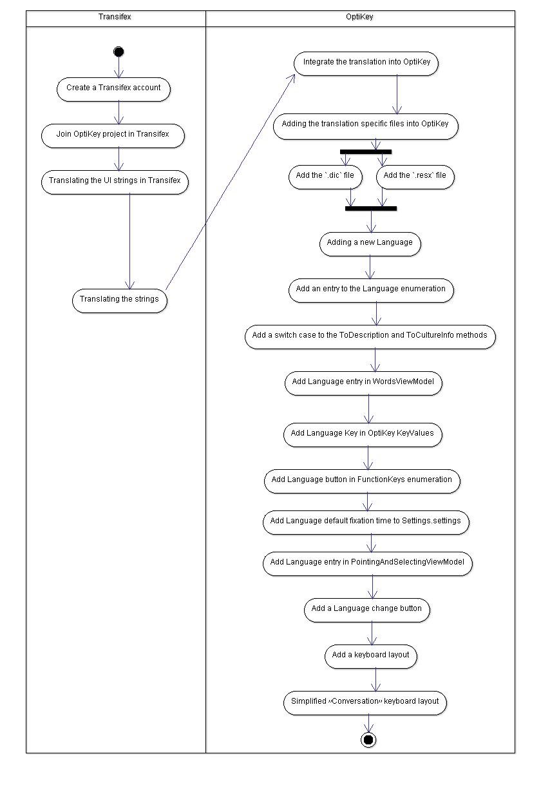

# Views and prespectives 
(stage 2)

## OptiKey Fork

* [OptiKey Fork](https://github.com/adirel/OptiKey) - this is our fork to the optikey project
* [OptiKey Fork - Modeling documentation folder](https://github.com/adirel/OptiKey/tree/master/docs/Modeling) - we created a new modeling folder into the optikey project in out fork.

## Documentation and general source code structure

* OptiKey project includes a "docs" folder which contains general information like credits, graphic design notes and some of the deployment proccess of this project.
* [OptiKey wiki](https://github.com/OptiKey/OptiKey/wiki) - contain a full user guide about the UI, General information, technical support and troubleshooting and installation proccess.
* [Video](https://www.youtube.com/watch?v=HLkyORh7vKk) - there is an intro video which is very helpfull.
* general source code structure - is a typicaly .Net formation project of WPF architecture. this is a very importent part which called "enums" and its decribe major part of the system code structure.
 general formation appears to be divided into external tools and main source code (divided by two folders) . inside the source code folder we can detect its seperated into three main areas - Main Source, Unit tests and Auto Complete Performance which is another user test cases and automaticly unit testing focus on performance. 
 

## Analyze and describe the main requirements/features of the product 
OptiKey is an assistive on-screen keyboard. It is designed to be used with a low cost eye-tracking device to bring keyboard control, mouse control and speech to people with motor and speech limitations. 
Main Features:
* [Typing words](https://github.com/OptiKey/OptiKey/wiki/Type-your-first-word)
* [Writing Numbers, symbols and diacritics](https://github.com/OptiKey/OptiKey/wiki/Numbers,-symbols-and-diacritics)
* [Using eye trackers](https://github.com/OptiKey/OptiKey/wiki/Using-eye-trackers)
* [Using webcams](https://github.com/OptiKey/OptiKey/wiki/Using-webcams)
* [Change selection method](https://github.com/OptiKey/OptiKey/wiki/Change-selection-method)
* [Speech](https://github.com/OptiKey/OptiKey/wiki/Speech)
* [Voice banking](https://github.com/OptiKey/OptiKey/wiki/Voice-banking)
* [Simulate a keyboard](https://github.com/OptiKey/OptiKey/wiki/Simulate-a-keyboard)
* [Simulate a mouse](https://github.com/OptiKey/OptiKey/wiki/Simulate-a-mouse)
* [Multi key selection](https://github.com/OptiKey/OptiKey/wiki/Multi-key-selection)
* [Auto Suggestions](https://github.com/OptiKey/OptiKey/wiki/Suggestions)
* [Auto capitalisation & auto spacing](https://github.com/OptiKey/OptiKey/wiki/Auto-capitalisation-&-auto-spacing)
* [Dictionary](https://github.com/OptiKey/OptiKey/wiki/The-dictionary)
* [Change Sizes & Positions](https://github.com/OptiKey/OptiKey/wiki/Size-&-position)
* [Transparency](https://github.com/OptiKey/OptiKey/wiki/Transparency)
* [Theme](https://github.com/OptiKey/OptiKey/wiki/Change-the-theme)
* [Conversation mode](https://github.com/OptiKey/OptiKey/wiki/Conversation-only-mode)
* [Sleep](https://github.com/OptiKey/OptiKey/wiki/Sleep)
* [Speed up & slow down](https://github.com/OptiKey/OptiKey/wiki/Speed-up-&-slow-down)
* [Visual settings](https://github.com/OptiKey/OptiKey/wiki/Visual-settings)
* [Sound settings](https://github.com/OptiKey/OptiKey/wiki/Sound-settings)
* [Word settings](https://github.com/OptiKey/OptiKey/wiki/Word-settings)
* [Pointing & selecting settings](https://github.com/OptiKey/OptiKey/wiki/Pointing-&-selecting-settings)

## Analyze and describe the major or important designs with UML diagrams and or other modeling means

one of the most importent stages which represent a open source comuninity add value and system expandad measors.
 this diagram describe the 4 stages wich needed to adding a new local.
* UI element translations
* a word dictionary
* a keyboard layout
* integrate them into OptiKey
 

## Describe a few challenges for this project
Issues:
* [Smart Screen or Virus Scanner warnings](https://github.com/OptiKey/OptiKey/wiki/Smart-Screen-or-Virus-Scanner-warnings)
* [Cannot open Management Console](https://github.com/OptiKey/OptiKey/wiki/Cannot-open-Management-Console)
* [Eye tracker problems](https://github.com/OptiKey/OptiKey/wiki/Eye-tracker-problems)
* [Factory reset all settings](https://github.com/OptiKey/OptiKey/wiki/Factory-reset-all-settings)
* [Factory reset the dictionary](https://github.com/OptiKey/OptiKey/wiki/Factory-reset-the-dictionary)
* [Multiple monitors](https://github.com/OptiKey/OptiKey/wiki/Multiple-monitors)
* [No menu key, no mouse key](https://github.com/OptiKey/OptiKey/wiki/No-Menu-key,-no-mouse-key)
* [Multi-key selection issues](https://github.com/OptiKey/OptiKey/wiki/Multi-key-selection-issues)
* [OS language has changed](https://github.com/OptiKey/OptiKey/wiki/OS-language-has-been-changed)

Localisation: 
* [Italian](https://github.com/OptiKey/OptiKey/issues/264)
* [Croatian](https://github.com/OptiKey/OptiKey/issues/263)
* [Slovene](https://github.com/OptiKey/OptiKey/issues/248)
* [Catalan](https://github.com/OptiKey/OptiKey/issues/235)
* [Polish](https://github.com/OptiKey/OptiKey/issues/238)
* [Portuguese](https://github.com/OptiKey/OptiKey/issues/234)
* [General](https://github.com/OptiKey/OptiKey/issues/148)

Bugs:
* [Disconnects from Eye Tribe Tracker](https://github.com/OptiKey/OptiKey/issues/254)

Wishlist:
* [Allow input from mouse and eye tracker](https://github.com/OptiKey/OptiKey/issues/228)
* [Multiple Dictionaries](https://github.com/OptiKey/OptiKey/issues/218)
* [Running OptiKey on system with multiple screens](https://github.com/OptiKey/OptiKey/issues/175)
 

