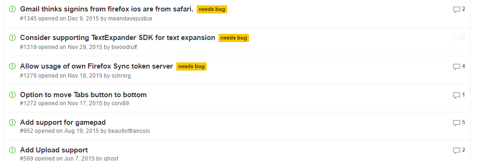
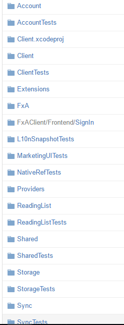

## firefox-ios - Class Project

Stage 0:

1. Project name: 
  - firefox-ios - firefox browser for ios
  - [firefox-ios Repository](https://github.com/mozilla/firefox-ios)
2. Team members:
    - [Rawi Sakhnini](https://github.com/rawisa)
    - [Marian Raad](https://github.com/marianera)
	

## Introduction

Firefox for iOS is a browser from Mozilla, for the Apple iPhone, iPad and iPod touch mobile devices.
It is the first Firefox branded browser to not use the Gecko layout engine as is used in Firefox for desktop and mobile. Due to Apple's application review policies, Firefox uses the built-in iOS WebKit-based rendering framework instead of Gecko.
Firefox for iOS supports Firefox Sync and is able to sync Firefox's browsing history, bookmarks, and recent tabs.

## Architecture

**A general browser architecture:**

[Reference](http://image.slidesharecdn.com/web-browserarchitecture-150609231155-lva1-app6892/95/web-browser-architecture-2-638.jpg?cb=1433891674)

**Firefox** architecture looks as the following figure, but because of Apple policies they had to use the build-in ios WebKit instead of gecko.

[Reference](http://www.shinylight.com/wp-content/uploads/2009/09/11.jpg)

## Resources 

Firefox is an open-source browser, users around the world help to improve it.
Contributers can communicate through: 
* IRC:            [#mobile](https://wiki.mozilla.org/IRC) for general discussion and [#mobistatus](https://wiki.mozilla.org/IRC) for team status updates.
* Mailing list:   [mobile-firefox-dev@mozilla.org](https://mail.mozilla.org/listinfo/mobile-firefox-dev).

They can find the bugs that need to be fixed at the following list:

* Bugs:           [File a new bug](https://bugzilla.mozilla.org/enter_bug.cgi?bug_file_loc=http%3A%2F%2F&bug_ignored=0&op_sys=iOS%20&product=Firefox%20for%20iOS&rep_platform=All) • [Existing bugs](https://bugzilla.mozilla.org/describecomponents.cgi?product=Firefox%20for%20iOS) 

# Statics

**The weekly commits:**

[Reference](https://github.com/mozilla/firefox-ios/graphs/commit-activity)

**Notice the high code change frequency:**

[Reference](https://github.com/mozilla/firefox-ios/graphs/code-frequency)

Looking at the following release frequency, one can understand that firefox uses the agile method.
Also according to [itbusinessedge](http://www.itbusinessedge.com/cm/blogs/all/mozilla-takes-hybrid-approach-to-agile-software-development/?cs=38988):
"Mozilla has also begun using a hybrid model that incorporates elements of both agile and waterfall approaches for its flagship Firefox Web browser. The goal is to more quickly introduce new features -- aided by agile's emphasis on iterative releases -- while maintaining backward compatibility, security and overall code quality.".

[Reference](https://github.com/mozilla/firefox-ios/releases)

Firefox has bugs/features list in their [issues](https://github.com/mozilla/firefox-ios/issues) in github:

[Reference](https://github.com/mozilla/firefox-ios/issues)

## Contributor guidelines

Using Firefox official site [Bugzilla](https://bugzilla.mozilla.org/). Developers can find a list of bugs in firefox
All developers must follow the following Swift style to keep the code orginized: https://github.com/raywenderlich/swift-style-guide.

With small * Exception: they use 4-space indentation instead of 2.

Further info can be found at [Firefox-ios contributor guidelines](https://github.com/mozilla/firefox-ios#contributor-guidelines)

## General source code structure

Firefox seperates code to packages to keep everything orginized to help developers add/fix features with an ease.
The following figure shows the code structure, one can see there is packages for : Account, Client, Extensions, etc... 
For most packages there is a corresponding package for tests:  AccountTest, ClientTest, etc... . That way if firefox-developers or external-contributers do changes, they dont break the browser functionality.
general detailed code structure can be found at (note: this code structure are for windows, but its the same for all platforms in general):
* https://developer.mozilla.org/en-US/docs/Mozilla/Developer_guide/Source_Code/Directory_structure
* http://codefirefox.com/video/source-structure

[Reference](https://github.com/mozilla/firefox-ios)

## Stakeholder view
* **Communicators**:

 are the people that provide documentation for the users and administrators of the system.
 Furthermore they may provide training for staff or the development team.
 Often communicators promote the product by communicating the product's key features and benefits to other stakeholders.

 Firefox is a global webbrowser, They have a "Mobilizers" community. Mobilizers are tech/geek enthusiasts that are committed to spreading Firefox OS, Mozilla's new mobile product. Mobilizers receive periodic missions asking them to do a simple action to teach others about the new Firefox OS. Mobilizers will also attend, assist or host events in their market about once a month [Reference](https://wiki.mozilla.org/FirefoxOS/Community/Mobilizers).

* **Developers**:

 are responsible for the implementation and deployment from the systems' specification.
 That is: design, code, test and accept.
 Their concerns lie with the platform used, programming languages for writing code, tools used, dependencies needed, as well as the maintainability and flexibility of the system.

 The most active and notable developers at this moment are: Stefan Arentz, Brian Nicholson, Stephan Leroux and Richard Newman. These developers create pull requests with new features or fixes (Stefan Arentz does only fixes for bugs). It is important to note that these are not the only developers working on the firefox project. The most core team can be found at [Firefox-team](https://wiki.mozilla.org/Firefox/Team/whois).

* **Testers**:

 test the system to ensure that it works exactly the way it was intended to work.
 
 [Stephan Leroux](https://github.com/sleroux) and [Brian Nicholson](https://github.com/thebnich), contribute the most to the tests, code tests, UI tests, etc... 

* **Funders**:

 Funders give money to the project to keep it alive.
 
 One of the best money incoming for firefox are the search engines such as Google, who pays firefox to make Google search engine as the default search engine for firefox.
 
* **Development team**:
 * Product Manager: Jen Bertsch
 * Project Manager: Mike Alexis
 * Content owner: Greg Jost
 * Copy: Natalie Linden
 * UX and Design: ZURB
 * Creative lead: Tim Murray
 * Foundation stakeholder: Andrea Wood
 * Advocacy stakeholder: Jochai Ben-Avie
 * Legal: Mika Devi
 * Web dev: Craig Cook
 * Analytics: Gareth C
 * L10N: Flod, Pascal Chevrel
 
 [Reference](https://wiki.mozilla.org/Websites/Mozilla.org/Smart_On)
 
 ## UML - Sequence diagram
 
 The following sequence diagram shows the important part of any webbrowser and how it works, how the MVC works in firefox:
 
 

[Reference](http://blog.quent.in/assets/wp-content/uploads/2012/04/index.png)
 
 
## Missing important feature
  
  According to [bugzilla](https://bugzilla.mozilla.org). Firefox is missing an important feature which filed at https://bugzilla.mozilla.org/show_bug.cgi?id=1228089.
  
  At it is recommended for the new contributers to add that features.
  
  Following [Swift style]( https://github.com/raywenderlich/swift-style-guide) which was recommended by firefox. We added the new feature, and created a pull request and attached it on there bugzilla site according to there [guidelines](https://github.com/mozilla/firefox-ios#contributor-guidelines)
  
  * [Forked repo.](https://github.com/rawisa/firefox-ios)
  * [PR](https://github.com/mozilla/firefox-ios/pull/1889) For the missing feature.