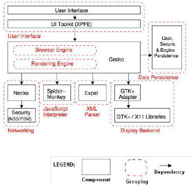
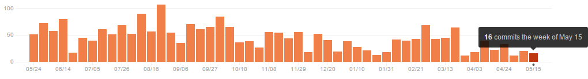
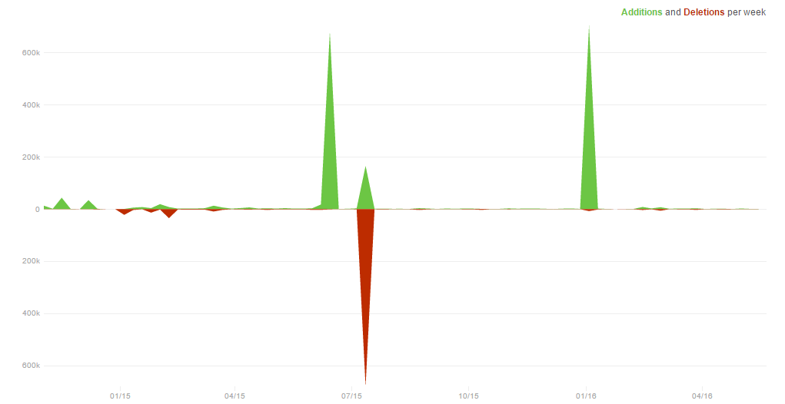
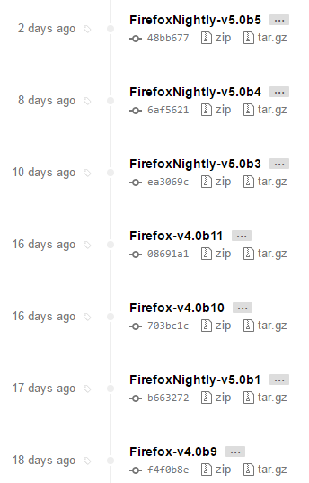

## firefox-ios - Class Project

Stage 0:

1. Project name: 
  - firefox-ios - firefox browser for ios
  - [firefox-ios Repository](https://github.com/mozilla/firefox-ios)
2. Team members:
    - [Rawi Sakhnini](https://github.com/rawisa)
    - [Marian Raad](https://github.com/marianera)
	

## Introduction

Firefox for iOS is a browser from Mozilla, for the Apple iPhone, iPad and iPod touch mobile devices.
It is the first Firefox branded browser to not use the Gecko layout engine as is used in Firefox for desktop and mobile. Due to Apple's application review policies, Firefox uses the built-in iOS WebKit-based rendering framework instead of Gecko.
Firefox for iOS supports Firefox Sync and is able to sync Firefox's browsing history, bookmarks, and recent tabs.

A general browser architecture:

Firefox architecture looks as the following figure, but because of Apple policies they had to use the build-in ios WebKit.

Firefox is an open-source browser, users around the world help to improve it.
Contributers can communicate through: 
* IRC:            [#mobile](https://wiki.mozilla.org/IRC) for general discussion and [#mobistatus](https://wiki.mozilla.org/IRC) for team status updates.
* Mailing list:   [mobile-firefox-dev@mozilla.org](https://mail.mozilla.org/listinfo/mobile-firefox-dev).
They can find the bugs that need to be fixed at the following list:
* Bugs:           [File a new bug](https://bugzilla.mozilla.org/enter_bug.cgi?bug_file_loc=http%3A%2F%2F&bug_ignored=0&op_sys=iOS%20&product=Firefox%20for%20iOS&rep_platform=All) • [Existing bugs](https://bugzilla.mozilla.org/describecomponents.cgi?product=Firefox%20for%20iOS) 

some statics taken from their github repo:
The weekly commits:

Notice the high code change frequency: 

Looking at the following release frequency, one can understand that firefox uses the agile method.
Also according to [itbusinessedge](http://www.itbusinessedge.com/cm/blogs/all/mozilla-takes-hybrid-approach-to-agile-software-development/?cs=38988):
"Mozilla has also begun using a hybrid model that incorporates elements of both agile and waterfall approaches for its flagship Firefox Web browser. The goal is to more quickly introduce new features -- aided by agile's emphasis on iterative releases -- while maintaining backward compatibility, security and overall code quality.".

